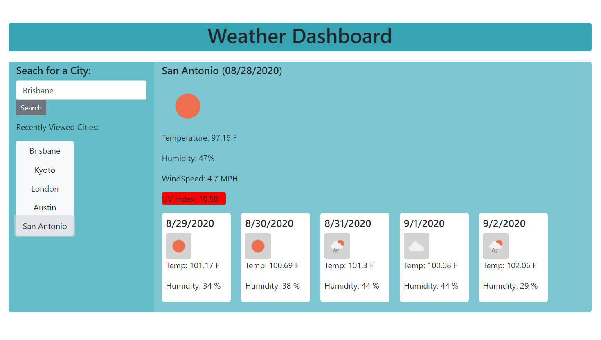

# HW-6-Weather-Dashboard

The following is a web application that provides a weather forecast for searched cities. Initially no weather information will be provided, until a city name is searched. Reloading the application returns the lalt city searched. A history of previously searched city will rendered and available to click and recall their weather. 

[link](https://drewalvarez.github.io/HW-6-Weather-Dashboard/)

